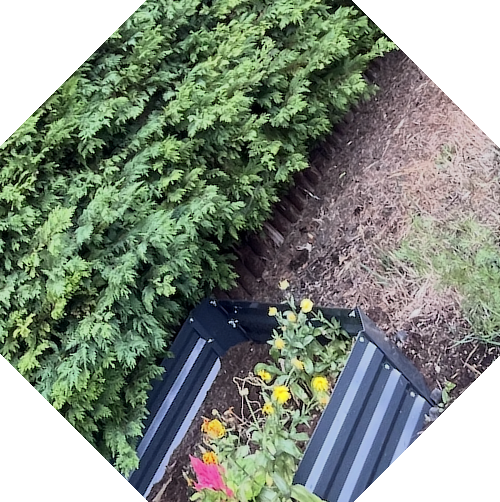
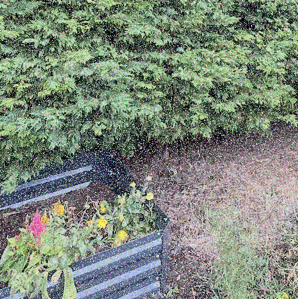

# image-augmentation-service
> This project is a **Work In Progress**

This project is a microservice which can be used to produce augmented versions of image data.
Here are some examples of what can be done with this service:

Before | Rotate | Noise
---- | ---- | ----
 | | 

## 🔮What is `augmentation`?
`Augmentation` is the process of artificially expanding a dataset by creating modified versions of existing data. It is a technique used to increase the size and diversity of a dataset without collecting new data. This is often to improve generalization and robustness of a neural network or other statistical model.

## 🙈 How does it work?
> Please note that the actual architecture is more complex than this explanation and documentation is ongoing.

The basic idea is this:

> A `client` sends a `request` to augment an `image`. This `image` is then processed `asychronously` by the `service`. The `service` sends back some information about how to retrieve the `augmented image`.

## How can I learn more about this project?

I aim to write clear documentation. 
The documentation lives in `/docs`.

Here are some useful articles for gettings started:
- [How to try the application?](docs/how-to/try-the-application.md)
- [How to run tests?](docs/how-to/run-tests.md)

### 🧠 Want to know more about the `engineering`?
- [PostgreSQL Database Design](docs/engineering/transactions_database/transactions_database.md)
- [How tests are structured](docs/engineering/testing/_testing.md)

## What is next?
This project is a **Work in Progress**.
However, there are some changes that I am considering all the time.

In no particular order:
- moving image processing to an async worker
- communicating data flow using `RabbitMQ`
- putting in some standard authentication mechanism (probably `JWT`)
- adding more tests (this is happening all the time)
- making an auxiliary `image-analysis-service`
- using the `ELK` stack for logging and observability
- using `Kubernetes` to orchestrate containers
- expanding the image processing immensely