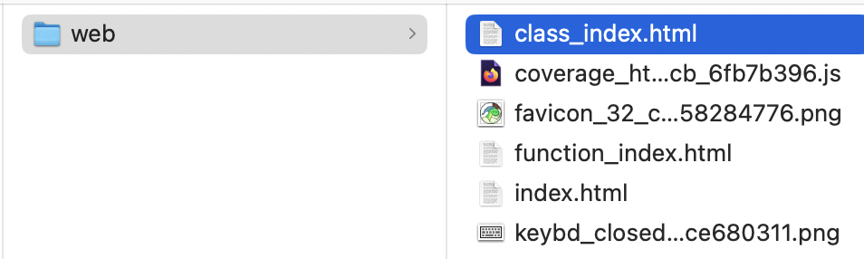

# How to Generate Test Coverage Reports?

There are 2 primary ways you can generate test coverage reports.

## Web Version

If you want to look at specific test suites, then this is my recommended approach.

You can generate a user-friendly view of the coverage report that is accessible via web browser.
Use the following command:
```terminaloutput
pytest --cov=. --cov-report=html:tests/coverage_report/web
```

### Open the Web Page
After you have run the command, just navigate to the page here:
```terminaloutput
.../image-augmentation-service/tests/coverage_report/web/*index.html
```

This is an image if you need guidance:




## JSON Version

If you want to integrate with a CI/CD pipeline or make this part of a larger services integration test, then I recommend this as part of you approach.

You can generate a json object which describes your test coverage report.
Use the following command:
```terminaloutput
pytest --cov=. --cov-report=json:tests/coverage_report/json
```
