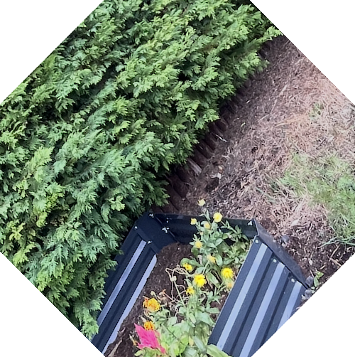

# How to try the application

In order to run this application you will need to install Docker.
The Dockerfile will build the application using the code from the repository.
The docker-compose file will get all of the required components and assemble them in a logical way.

## Prerequisites

### .env
I have included a `.env.example` file. Docker will source important variables for connecting the database from here.
Please:
- make a copy of this file
- remove the `.example` extension from the filename
- insert your own value where it says: `# replace_with_your_own_information`

#### Important Note
Never commit your `.env` file.

### Docker
This application runs using Docker containers!
site: https://www.docker.com
Follow the installation instructions for your system.

#### Docker Commands
To run the application (in `dev` mode) use the following command:
```
docker compose --profile dev up
```
To stop the application use the following command:
```
docker compose down
```


### Try the API
The application uses FastAPI as a core dependency.
FastAPI provides an interactive page to try out the API right out of the box.

reference: https://fastapi.tiangolo.com/tutorial/first-steps/#check-it

You just need to run the application.
When the application is running, you just need to go to the following URL:
```
http://localhost:8000/docs
```

#### Step 1: Make a User

You need to make a user so that you can do image transformations.
Use the following endpoint in the documentation:
`/users-api/users`
Open the request interface using the drop-down button.
Then click `Try it out`.
Then enter an `X-External-User-ID` string such as:
```terminaloutput
shoop-da-whoop
```
You will then get a `Curl` command that you may find useful later.
Below the curl command you will see a response body.
If you have never used this `external-id` you should see a response body such as:
```terminaloutput
{
  "id": "5e4968db-f945-4c51-889f-06c22065d7b9",
  "external_id": "shoop-da-whoop",
  "created_at": "2025-09-12T08:18:15.817554Z"
}
```

#### Step 2: Upload an Image

Once you have a user you can do some image transformations.
Use the following endpoint in the documentation:
`/image-api/upload/`

Then define the request body:
- Choose a `png` image file. Please note that image size and type are not contrained at this time.
- If you want one you can find one here: `/tests/date/test_image.png`
- Enter the following string for the `body` field:
```terminaloutput
{"arguments": {"processing": "rotate", "angle": 45}}
```

##### Example:

Here are some examples of image processing.

Before:


After:
```terminaloutput
{"arguments": {"processing": "rotate", "angle": 45}}
```

    